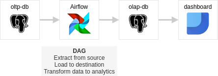
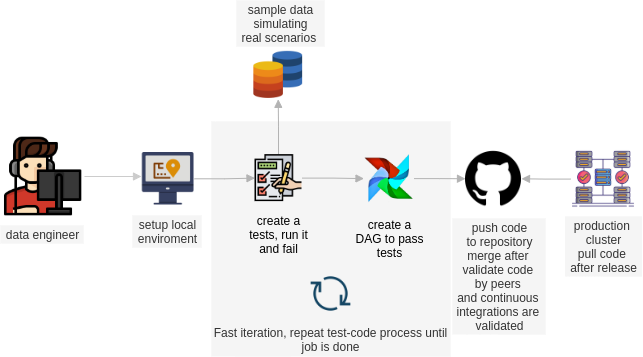

# Airflow DAG development with tests + CI workflow


This code is complementar to the article [How to develop data pipeline in Airflow through TDD (test-driven development)](https://medium.com/@marcosmarxm/how-to-build-a-dataops-enviroment-with-airflow-part-1-setup-ci-cd-and-dag-pipeline-tests-13cdf050439e).
I suggest you to read to better understand the code and the way I think how to setup the project.

## The project

Below is a summary of what will be accomplished in this project. We'll simulate the transfer of some fake transaction data from an ecommerce. A simple task transfering data from the `otlp-db` database to the `olap-db` database.



To help in the development we use a local development environment to build the pipeline with tests and also a Continuous Integration pipeline with Github Action to ensure that tests are applied at each change.

**Containers**
- **airflow**: container running local setup for development;
- **oltp-db** and **olap-db**: container that simulate database in a production environment and receive fake data;

In this tutorial we won't developt the dashboard part only the pipeline.

### Dependencies?
Docker, docker-compose and makefile.

### How to run?

The command below will setup the environment using docker-compose. Wait a few minutes (240s, yeah omg right?) to Airflow initialize its internal configuration, then the command will create credentials and connections.
```bash
make setup
```
By running the above command it is possible to access Airflow at `localhost: 8080`. 
A user of test user: admin / password: admin is created. At this stage you can develop your DAGs and test them as you modify them.
And finally, the command that calls the `pytest` to perform tests.
```bash
make testing
```

---

Some resources about Airflow testing and DataOps:
* [Pipelines on pipelines: Agile CI/CD workflows for Airflow DAGs @ Airflow Summit 2020](https://www.youtube.com/watch?v=tY4F9X5l6dg)
* [Data Testing with Airflow](https://github.com/danielvdende/data-testing-with-airflow)
* [Data's Inferno: 7 Circles of Data Testing Hell with Airflow](https://medium.com/wbaa/datas-inferno-7-circles-of-data-testing-hell-with-airflow-cef4adff58d8)
* [Testing and Debugging in Apache Airflow by GoDataDriven](https://godatadriven.com/blog/testing-and-debugging-apache-airflow/)
* [The Challenge of Testing Data Pipelines](https://medium.com/slalom-build/the-challenge-of-testing-data-pipelines-4450744a84f1)
* [Automated Testing for Proceting Data Pipeliens from Undocumented Assumptions](https://www.youtube.com/watch?v=z-kPgEAJCrA&ab_channel=Databricks)
* [Why Great Data Engineering Needs Automated Testing](https://medium.com/weareservian/why-data-engineering-needs-automated-testing-a37a0844d7db)
* [Testing in Airflow Part 1 - DAG validation tests, DAG definition tests and unit tests](https://blog.usejournal.com/testing-in-airflow-part-1-dag-validation-tests-dag-definition-tests-and-unit-tests-2aa94970570c)
* [Testing in Airflow Part 2 - Integration Tests and e2e Pipeline Tests](https://medium.com/@chandukavar/testing-in-airflow-part-2-integration-tests-and-end-to-end-pipeline-tests-af0555cd1a82)
